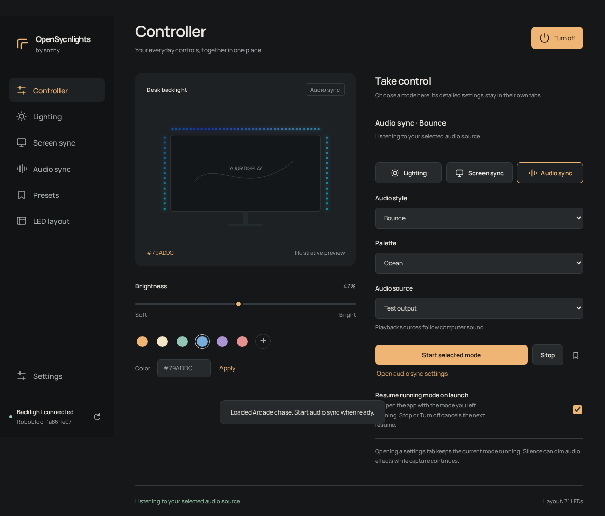

# Open-LumaSync-Linux

**A Linux alternative to the official Robobloq SyncLight software, with a dedicated Omarchy bar plugin.**

Control a supported USB backlight directly from Linux: screen colors, audio effects, lighting scenes, brightness and LED layout. This project was created because the official SyncLight desktop application does not support Linux. Normal operation uses local USB control and does not need Wine, Steam, a cloud account or an internet connection.

Developed by **snzhy**, adapted from [openLightsSync by crisnar](https://github.com/crisnar/openLightsSync). This is an independent community project; it is not an official Robobloq application.



*Interface example from the browser regression checks. The LED illustration is a settings preview, not live hardware telemetry.*

## What it does

- **Screen sync:** sample the display's left, top and right edges. Colors come from the screen; manual color controls are hidden. Choose a monitor, capture rate, smoothing, sample depth and direction.
- **Audio sync:** 15 styles, including Bounce, Spectrum, Beat, Comet, Twin bounce, Ripple, Volume bars, Pulse, Swell, Sparks, Prism, Tremor and Orbit. Choose from ten palettes or blend your own colors; adjust sensitivity, movement, trail width, quiet-sound gating and direction.
- **Lighting:** 20 modes, including Static, Rainbow, Aurora, Ocean currents, Scanner, Meteor, Fireworks and Rainbow wave.
- **Presets:** 60 built-in scenes across lighting, audio and screen sync, with search, favorites, personal scenes, JSON import/export and eight screen profiles.
- **Controller:** quick mode changes, brightness and power, connection status and optional resume of the last running mode.
- **Omarchy plugin:** a Backlight popup beside the tray, login startup and background control through the same app and USB owner.
- **Customization:** dark/light themes, five accents, compact controls, reduced motion and LED-layout calibration.

## Compatibility

| Component | Status |
|---|---|
| Robobloq USB HID `1a86:fe07` | Tested on a 54-LED SyncLight controller, firmware 1.9.4 |
| USB ID `1a86:fe0c` | Inherited device-ID support; not hardware-tested by this project |
| Omarchy with Hyprland and Quickshell plugin commands | Primary tested desktop |
| Other Linux desktops | Standalone source build is available; desktop and capture compatibility need testing |
| Wi-Fi-only backlights | Not supported; this application uses USB HID |

Screen sync is experimental and currently targeted at Hyprland with `grim`. Choose 0.2×, 0.35×, 0.5× or full capture quality to trade detail for CPU use; live capture, processing and USB timings appear while it runs. Performance depends on your display, capture workload and hardware. Audio sync captures a PulseAudio/PipeWire playback monitor or selected input; the backlight's built-in microphone is separate.

## Install

Start with the complete [installation guide](INSTALL.md) for dependencies, USB permissions and troubleshooting.

From the extracted or cloned project folder, after installing dependencies:

```sh
# App, application-menu entry, Omarchy widget and login service
./install.sh --omarchy

# App and application-menu entry only
./install.sh
```

The installer builds the locked Rust dependencies and installs for your user. A first build needs internet access. `--offline` is optional when dependencies are already cached. Do not run the installer as root. Quit a standalone app instance before installing or updating.

The installed app does not depend on keeping the checkout: open **snzhy-OpenSycnlights** from the application menu or run `~/.local/bin/snzhy-opensycnlights`.

## First use

1. Connect the light over USB and confirm **Backlight connected**. If it says permissions are needed, follow [USB access](INSTALL.md#usb-access).
2. Open **LED layout** and match the left/top/right LED counts to the physical strip. Monitor size alone does not determine LED counts.
3. Choose a mode in **Controller**, adjust its settings and press **Start selected mode**.
4. For Screen sync, select the monitor behind the light. For Audio sync, select your playback device's monitor and play music.
5. Enable **Resume running mode on launch** or **Resume at login** if you want automatic restoration. Stop and Turn off cancel the next resume.

Closing the window keeps the current mode running. Use **Quit** in the tray to exit. See the [usage guide](USAGE.md) for all controls and presets.

## Omarchy bar plugin

The dedicated plugin ID is **`snzhy.backlight`**. Click the monitor/backlight icon beside the tray for mode switching, Stop, power, brightness, monitor selection, Balanced/Gaming screen presets and resume at login. **Open controller** brings up the existing app.

The plugin talks to the background controller through session D-Bus. It does not create another USB writer. The user service is **`snzhy-backlight.service`**; it starts hidden with your graphical session. Quitting exits for that session, and a bar action can start it again.

```sh
~/.local/bin/snzhy-backlight status
~/.local/bin/snzhy-backlight show
systemctl --user status snzhy-backlight.service
```

The plugin is installed under your user configuration; Omarchy's packaged files are not modified. It needs an Omarchy version exposing `omarchy plugin` and `omarchy-shell`; it is not a Waybar module.

## Help, development and sharing

- [Install, update and uninstall](INSTALL.md)
- [Use modes, presets and the Omarchy widget](USAGE.md)
- [Troubleshoot USB, audio, screen capture and startup](TROUBLESHOOTING.md)
- [Build and test](BUILD.md)
- [Contribute and report bugs](CONTRIBUTING.md)
- [Publish your copy on GitHub](PUBLISHING.md)
- [Stock USB protocol notes](STOCK-PROTOCOL.md)

## License and attribution

This project is a derivative of openLightsSync by crisnar and contributors, distributed under **CC BY-NC-SA 4.0**: attribution required, noncommercial use, share alike. Keep the upstream credit and the same license when sharing modified copies. See [LICENSE](LICENSE) and [ATTRIBUTION.md](ATTRIBUTION.md). The bundled Manrope font uses the [SIL Open Font License](ui/fonts/OFL.txt).
